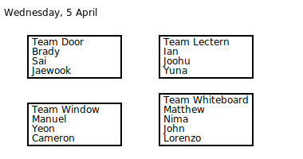

---

# Math 227C: Stochastic modeling and statistical modeling for the life sciences

* The repository will be updated throughout the course, including with lecture notes. A convenient way to rapidly synchronize a copy onto your computer is using git, available openly online.

* In the second part of the course, we will make use of Jupyter notebooks and the R programming language. We plan to start using Jupyter around the 5th week of class. There are (at least) three ways to run Jupyter R notebooks. Here is a [brief guide](INSTALLATION.md). 

* In the first part of the course, a good tool for typesetting mathematical homeworks is LaTeX. A good tutorial to learn LaTeX is [here](https://www.overleaf.com/learn/latex/Tutorials).
* In the second part of the course, we will make use of R. A few good tutorials and resources:
  - [R Tutorial from W3C](https://www.w3schools.com/r/)
  - [R cheatsheet](https://iqss.github.io/dss-workshops/R/Rintro/base-r-cheat-sheet.pdf) with loops, if statements, `lapply`, etc. 
  - [R for Data Science](https://r4ds.had.co.nz/)
  - [Jupyter and R Documentation](https://irkernel.github.io/docs/)

## Premise

This course follows MATH 227A and 227B in establishing mathematical and computational tools for modeling the dynamics of biological systems. 
This course, MATH 227C, is in two parts: the first covers stochastic processes, where randomness plays a role in the system behavior; the second covers statistical modeling, where models, including their attributes such as parameters, are learned from data in the presence of noise or inherent randomness in the model.

## Lecture notes

* [In-class hand notes](LectureNotes)

* [In-class Jupyter notebooks](LectureNotebooks)

## Problem sets

1. [Probability events / Protein-protein interaction network](ProblemSets_PartI/Math227C_P1.pdf)

2. [Discrete Markov chains / Introns and exons](ProblemSets_PartI/Math227C_P2.pdf)

3. [Mean first passage / Histone unwrapping, umbrellas](ProblemSets_PartI/Math227C_P3.pdf)

4. [Poisson processes / Two point mutations, my advisor is late](ProblemSets_PartI/Math227C_P4.pdf)

5. [Continuous-time Markov chain / Receptor-ligand binding](ProblemSets_PartI/Math227C_P5.pdf)

6. [Heterogeneity in a population](ProblemSets_PartI/Math227C_P6.pdf)

7. [Allometric scaling in pediatric pharmacokinetics](ProblemSets_PartII/Math227C_P7.ipynb)

8. [TO BE RELEASED] The variance-bias tradeoff / Flow cytometry

9. [TO BE RELEASED] High-dimensional data / Microbiome

10. [TO BE RELEASED] Bootstrap / Proportional hazards on liver disease data

11. [TO BE RELEASED] Flat priors / Chemical kinetics 

## Scheduling

Special dates

- There will be no lecture Friday, April 25th (week 4). 
- There will be no lecture Monday, May 5th (week 6).
- Instead we will have
  * [You picked:] out-of-class recorded lectures. These will be released throughout the quarter.
  * ~~A bonus class Tue, Jun 10, 1:30-3:30pm	(our exam slot)~~

## Reading

There is no required textbook for the course. However, the following textbooks are recommended for further reading.

* Wan, F. Stochastic Models in the Life Sciences
* Ross, S. Introduction to Probability Models. Academic press.
* [James, Tibshirani, R, An Introduction to Statistical Learning](https://www.statlearning.com/) free online. 
* [Huber and Holmes, Modern Statistics for Modern Biology](https://www.huber.embl.de/msmb/) free online.
* [Goodfellow, I., Bengio, Y., & Courville, A. Deep learning.](https://www.deeplearningbook.org/) free online.

A rough correspondence between topics and textbooks is given below.

| Topic | Textbooks |
| --- | --- |
| Probability basics | Goodfellow3, Ross1,2 |
| Discrete Markov chains | Wan2, Ross4  | 
| First-passage a.k.a. first-hitting | Wan3, Ross4 | 
| Poisson processes | Wan5, Ross5.3 | 
| Continuous-time Markov chain | Ross6 | 
| Heterogeneity | Wan9 | 
| Variance-bias tradeoff (aka bias-variance tradeoff) | James2.2, James5.1, Huber12.6 | 
|  k-nearest-neighbors |  James4, Huber5.6, Huber12.6 | 
| Logistic regression | James4.3 | 
| LASSO | James6, Huber12, Goodfellow7 | 
| Bootstrap | James5 | 
| Cross-validation | James5 | 
| MCMC | Goodfellow17 | 

